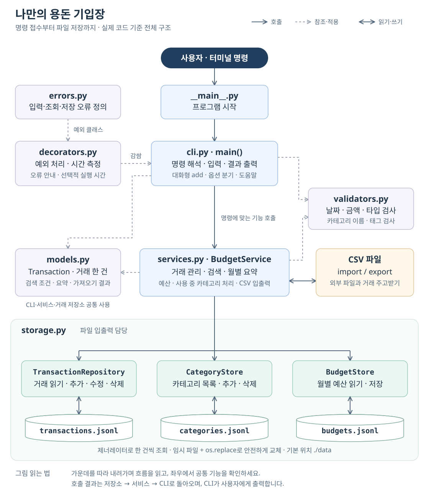
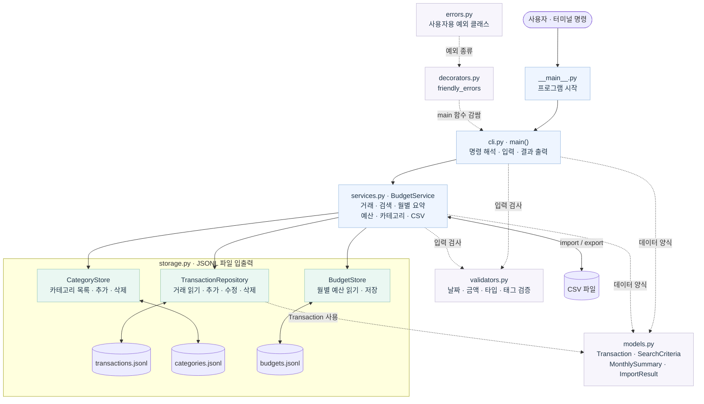

# 나만의 용돈 기입장

Python 표준 라이브러리만 사용한 JSONL 파일 기반 콘솔 용돈 기입장입니다. 거래 추가·목록·수정·삭제·검색·월별 요약, 카테고리, 예산, CSV 가져오기/내보내기를 지원합니다.

## 1. 실행 환경

- Python 3.10 이상
- 외부 라이브러리 설치 불필요
- 프로젝트 최상위 폴더(`README.md`가 있는 위치)에서 실행

```text
python -m budget_app --help
```

Windows에서 `python` 대신 `py` 명령만 동작한다면 다음처럼 실행합니다.

```text
py -m budget_app --help
```

기본 저장 폴더는 `./data`입니다. 다른 위치를 사용하려면 `--data-dir PATH`를 명령의 앞이나 뒤에 지정할 수 있습니다.

```text
python -m budget_app --data-dir ./my-data list
python -m budget_app list --data-dir ./my-data
```

## 2. 프로젝트 구조와 책임

```text
budget_app/
├─ __main__.py       # python -m budget_app 시작점
├─ cli.py            # 명령/옵션 해석, 대화형 입력, 화면 출력
├─ models.py         # Transaction 등 dataclass 데이터 모델
├─ services.py       # 거래·검색·요약·CSV 업무 규칙
├─ storage.py        # JSONL 저장소, 제너레이터, 원자적 파일 교체
├─ validators.py     # 날짜·타입·금액·태그 입력 검증
├─ decorators.py     # 공통 예외 처리 데코레이터
└─ errors.py         # 사용자용 예외 클래스
tests/
└─ test_budget_app.py
docs/
├─ architecture.svg # 확대해도 선명한 전체 구조도
├─ architecture.png # 구조도 이미지
└─ architecture.mmd # 수정 가능한 Mermaid 원본
sample_import.csv
README.md
```

각 계층의 역할은 다음과 같습니다.

- 모델: 거래 데이터의 모양과 검색 조건을 정의합니다.
- 저장소: 파일을 읽고 쓰는 방법만 책임집니다.
- 서비스: 입력 검증, 월별 합계, 카테고리 교체 등 업무 규칙을 처리합니다.
- CLI: 사용자의 명령과 입력을 받아 서비스에 전달하고 결과를 출력합니다.

### 프로그램이 움직이는 순서

가운데 세로선을 따라 **사용자 → 시작 → 명령 접수 → 업무 처리 → 저장소** 순서로 읽습니다. 좌우에는 데이터 모델·입력 검증·오류 처리·CSV를, 아래에는 세 저장소와 각각의 JSONL 파일을 배치했습니다.

[](docs/architecture.svg)

[크게 보기 · SVG](docs/architecture.svg) / [이미지 · PNG](docs/architecture.png) / [Mermaid 원본](docs/architecture.mmd)

사용자 입력과 화면 출력은 `cli.py` 안의 `_handle_add()`, `_print_transactions()`, `_print_summary()` 등이 담당합니다. `decorators.py`의 `friendly_errors`는 `cli.py`의 **`main()`을 감쌉니다**. `models.py`의 데이터 구조는 CLI·서비스·거래 저장소가 공통으로 사용하며, 서비스는 CSV와 거래를 주고받습니다.

<details>
<summary>Mermaid 구조도 펼치기</summary>



</details>

## 3. 저장 파일

처음 명령을 실행하면 저장 폴더와 다음 세 JSONL 파일이 자동 생성됩니다.

- `data/transactions.jsonl`: 거래 내역
- `data/categories.jsonl`: 카테고리
- `data/budgets.jsonl`: 월별 예산

JSONL은 한 줄에 JSON 객체 하나를 저장하는 형식입니다. 거래 파일은 날짜·ID 오름차순으로 유지합니다. 목록과 검색은 파일 전체를 리스트로 올리지 않고, `yield` 제너레이터가 파일 끝에서부터 블록 단위로 읽어 거래 날짜 최신순으로 생성합니다.

수정과 삭제는 원본 파일을 즉시 덮어쓰지 않습니다. 같은 폴더에 임시 파일을 완성하고 `os.replace()`로 원본과 교체하여 작업 도중 실패해도 원본 손상 가능성을 줄였습니다.

## 4. 명령 사용법

모든 명령은 `--help`를 지원합니다.

```text
python -m budget_app <command> --help
```

### 거래 추가

`add`는 날짜, 타입, 카테고리, 금액, 메모, 태그를 차례로 묻습니다. 날짜나 금액이 잘못되면 이유와 예시를 보여 주고 다시 입력받습니다.

```text
python -m budget_app add
```

### 거래 목록

거래 날짜가 최신인 거래부터 보여 줍니다. 같은 날짜라면 ID가 큰 거래가 먼저 나오며, 기본 개수는 20건입니다.

```text
python -m budget_app list
python -m budget_app list --limit 3
```

### 거래 검색

지정한 조건을 모두 만족하는 거래만 최신 등록순으로 출력합니다. 조건은 필요한 것만 조합합니다.

```text
python -m budget_app search --from 2024-01-01 --to 2024-01-31
python -m budget_app search --category food --type expense
python -m budget_app search --q 점심 --tag meal
```

### 거래 수정

이 프로젝트는 과제에서 허용한 **옵션 기반 수정 방식**으로 고정했습니다. ID와 변경할 필드만 지정합니다. 빈 `--tags ""`는 태그 전체 삭제를 뜻합니다.

```text
python -m budget_app update --id TX-000001 --amount 18000 --memo "저녁 식사"
python -m budget_app update --id TX-000001 --category other --tags "meal,friend"
```

### 거래 삭제

```text
python -m budget_app delete --id TX-000001
```

없는 ID는 사용자용 오류 메시지와 힌트를 출력하며 0이 아닌 종료 코드로 끝납니다.

### 월별 요약

총수입, 총지출, 잔액, 카테고리별 지출 TOP N을 출력합니다. 거래가 없으면 `데이터 없음`을 출력합니다.

```text
python -m budget_app summary --month 2024-01
python -m budget_app summary --month 2024-01 --top 3
```

### 예산 설정 및 조회

```text
python -m budget_app budget set --month 2024-01 --amount 500000
python -m budget_app budget show --month 2024-01
```

예산이 설정된 달의 `summary`에는 사용률이 표시되며, 총지출이 예산보다 크면 초과 금액과 경고를 출력합니다.

### 카테고리 관리

```text
python -m budget_app category add
python -m budget_app category add gift
python -m budget_app category list
python -m budget_app category remove gift
```

사용 중인 카테고리는 바로 삭제할 수 없습니다. 등록된 다른 카테고리를 `--replacement`로 지정하면 기존 거래를 안전하게 옮긴 뒤 삭제합니다.

```text
python -m budget_app category remove food --replacement other
```

### CSV 가져오기

```text
python -m budget_app import --from sample_import.csv
```

정상 행은 새 ID로 저장합니다. 잘못된 행은 건너뛰고 행 번호와 이유를 출력합니다. 파일 없음이나 잘못된 헤더는 오류로 종료합니다.

### CSV 내보내기

월 또는 날짜 범위 중 하나를 반드시 지정합니다.

```text
python -m budget_app export --out export.csv --month 2024-01
python -m budget_app export --out export.csv --from 2024-01-01 --to 2024-01-31
```

## 5. CSV 스키마

UTF-8 인코딩과 헤더를 사용합니다.

| 열 | 필수 | 규칙 |
|---|---:|---|
| `date` | Y | `YYYY-MM-DD` |
| `type` | Y | `income` 또는 `expense` |
| `category` | Y | 이미 등록된 카테고리 |
| `amount` | Y | 양의 정수 |
| `memo` | N | 문자열 |
| `tags` | N | 세미콜론(`;`) 또는 쉼표로 구분 |

## 6. 예외 처리와 종료 코드

`friendly_errors` 데코레이터가 명령 실행 중의 공통 예외를 한곳에서 처리합니다. 오류가 나면 스택트레이스 대신 `[오류] 원인`과 `[힌트] 해결 방법`을 출력합니다.

- 정상 종료: `0`
- 사용자 입력/없는 데이터 오류: `2`
- 파일 처리 오류: `3`
- 입력 강제 중단: `130`
- 예상하지 못한 오류: `1`

## 7. 테스트

외부 라이브러리 없이 표준 `unittest`로 실행합니다.

```text
python -m unittest discover -s tests -v
```

테스트는 날짜/금액 검증, JSONL 세 파일 생성, 고유 ID, 스트리밍 역순 조회, 복합 검색, 요약과 예산 경고, 원자적 수정/삭제, 사용 중 카테고리 교체, CSV 입출력, CLI 오류 종료 코드를 확인합니다.
